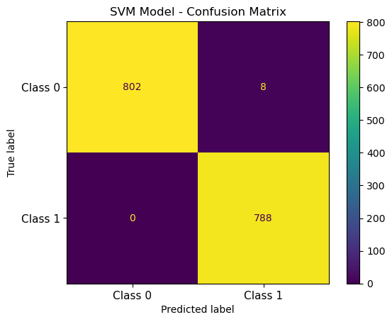
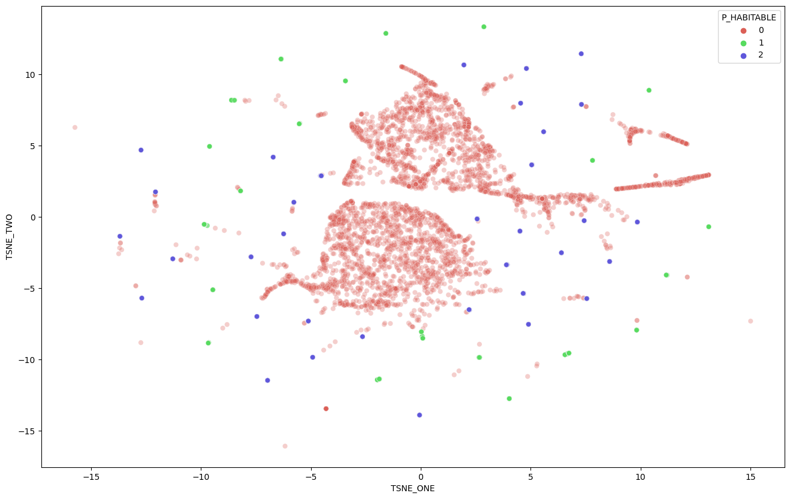
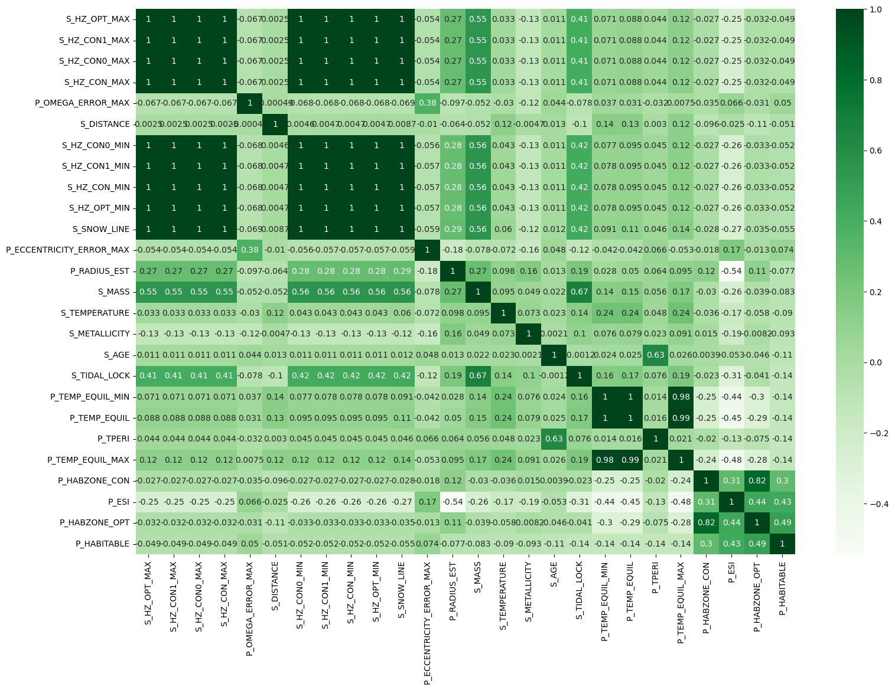
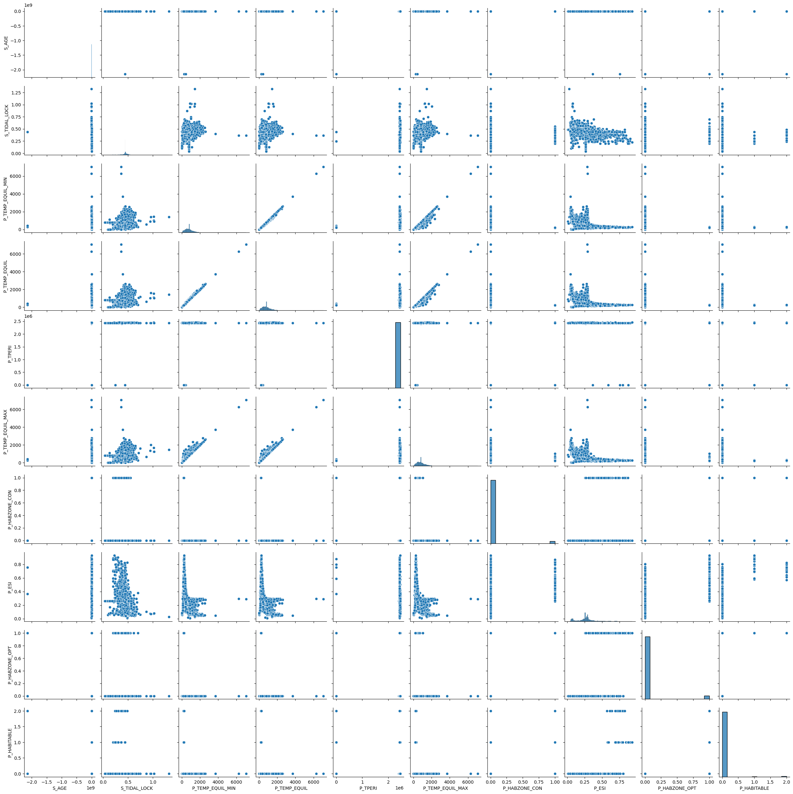
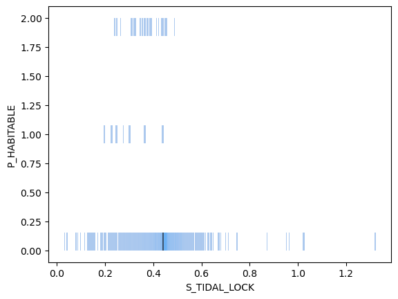
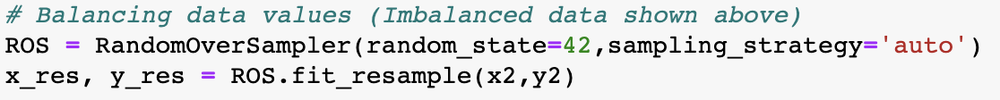
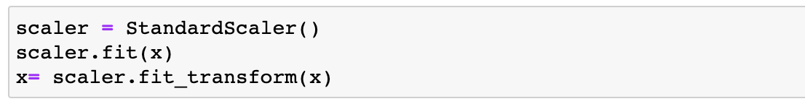
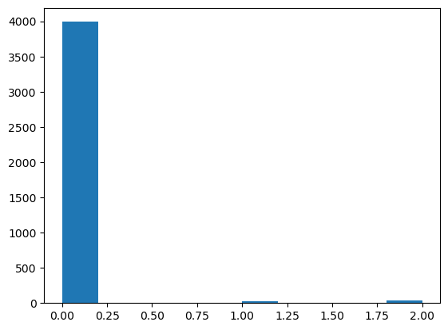
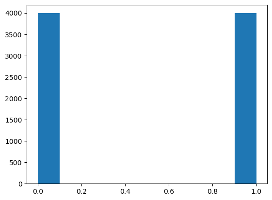

#  Predicting Habitability Using The PHL Exoplanet Catalog
**Benjamin Prentice, Noah Psutka** 

* [Dataset](https://www.kaggle.com/datasets/chandrimad31/phl-exoplanet-catalog) 

## Project Summary

# ADD HERE

<Complete for [Project Submission](https://canvas.txstate.edu/courses/1993336/assignments/27480566) assignment submission. See github.com repositories on how people shortblurb thre project e.g. REMOVE: It is a standalone section. It is written to give the reader a summary of your work. Be sure to specific, yet brief. Write this paragraph last (150-300 words)

<Fully rewrite the summary as the last step for the [Project Submission](https://canvas.txstate.edu/courses/1993336/assignments/27480566)>

## Problem Statement

* We will be using a binary classification prediction model. The
class label we will predict will be in regards to the habitability of a planet;
not-habitable = 0, habitable = 1

* Typical algorithms used for binary classification are KNN, Logistic Regression,
SVM's and Decision Trees. These will be the benchmarks used to determine the output
class labels.
Imbalanced (Binary) Classification: Many of our data points for habitability belong
to the non-habitable label; Therefore we will be using cost-sensitive versions of
logistic regression, SVM's and Decision Trees.
* Data comes from kaggle, the link to the dataset is provide at top of this page.
Success measures will be Precision, Recall, and the F-Measure
Recall will be one of the most important measures for our model because we do not wish
to mislabel a habitable planet as inhabitable.
We will not be using "accuracy" as a performance metric as it can be misleading in
imbalanced binary tasks.
* This project was created in hopes of creating a model that can predict what
features are the strongest predictors for a planet to be habitable. This information
can be used to narrow the search of stars for habitable planets.

## Dataset
    
* Description: Prior to preprocessing dataset, the dataframe size is (4048, 112). We narrowed down the dataset to only contain columns/variables that were relevant to our problem.
    
* Some notable features are:
    
     * S_METALLICITY - abundance of elements present in the planet that are heavier than hydrogen and helium
     * S_AGE - age of the planet 
     * S_TIDAL_LOCK - situation in which an astronomical object's orbital period matches its rotational period
     * P_TEMP_EQUIL_MIN - minimum temperature estimated in degrees Kelvin
     * P_TEMP_EQUIL - average temperature estimated in degrees Kelvin
     * P_TPERI - time of passage at the periapse for eccentric orbits
     * P_TEMP_EQUIL_MAX - maximum temperature estimated in degrees Kelvin
     * P_HABZONE_CON - not in the habitable zone of a star ( binary classification )
     * P_ESI - Earth Similarity Index, a measure of similarity to Earth's stellar flux, and mass or radius (Earth=1.0)
     * P_HABZONE_OPT - in the habitable zone of a star ( binary classification )
    
* Benchmarks:
    We are evaluating other published models to use as benchmarks. None has been chosen yet. Another benchmark used was our intitial model.

* Processing Tools Used: 
    
     * Scikit-Learn - cross_val_score, TSNE, PCA, StandardScaler, ConfusionMatrixDisplay, LabelEncoder, train_test_split
    
     
     
     
     * Seaborn - heatmap, pairplot, histplot, scatterplot

     
     
     
     
     * Pandas - read_csv, dataframe
     * Numpy
     * Matplotlib - hist, plot formatting
     * Imblearn - RandomOverSampler
     
     

## Exploratory Data Analysis 

* EDA graphs - 
    
    We plan on using pairplots, histograms, confusion matrices, and heatmaps. Other EDA graphs will likely be very useful.
    
* Why? - 
    
    * Pairplots can help us visualize the correlation between each feature.
    * Histograms can give us a closer look at this data.
    * Confusion matrices can help us to evaluate the accuracy of a model.
    * Heatmaps help us see correlation between features.
    
* The alogrithms we used for data preprocessing were StandardScaler and RandomOversampler.
 
  
  
  
  
  
* StandardScaler was used because it seemed the most widely used way to scale features. Normalization was attempted but with little change to our results.

## Data Preprocessing 

* We used Standard Scaler to scale our dataset. We also eliminated features that had very high correlation with each other.

## Machine Learning Approaches

* We will test different models and log any improvement with each. We have already seen marked improvement by using different techniques, such as random oversampling.
    
* We will be using classification algorithms, because our target is a binary classification. We plan on trying logistic regression, support vector machines, decision trees, and K-nearest neighbors algorithms.

* We used the PHL Exoplanet Catalog. Features used are:  
    
   P_OMEGA_ERROR_MA, S_DISTANCE, S_SNOW_LINE, P_ECCENTRICITY_ERROR_MAX, P_RADIUS_EST, S_MASS, S_TEMPERATURE, S_METALLICITY, S_AGE,  S_TIDAL_LOCK, P_TEMP_EQUIL, P_TPERI, P_HABZONE_CON, P_ESI, P_HABZONE_OPT
    
   * These features were scaled using Standard Scaler. 
  
  * We used a correlation matrix to determine the features that were heavily correlated with each other. This allowed us to drop features that would have skewed the results. 
  * We used Label Encoder to determine if there was any correlation between habitability and the feature columns that contained objects.
  * We used a pairplot to visualize the relationship between features and habitability which gave us further confidence in our decisions.
  * We used confusion matrices which led us to combine classes 1 & 2.

* Make sure to include at least two models: (1) baseline model, and (2) improvement model(s).  
   * The baseline model is typically the simplest model that's applicable to that data problem, something we have learned in the class. 
   * Our baseline model were created using logistic regression or SVM ran on the base dataset. We selected the features to test on, 
   and then ran the models on the data prior to preprocessing the features, then we ran the models again after processing the data
   * Improvement model(s) are available on Kaggle challenge site, and you can research github.com and papers with code for approaches.  
   * Improvement models could include XGBoost and machine learning methods for replacing null values.

## Experiments 

# ADD HERE

This section should only contain final version of the experiments. Please use visualizations whenever possible.
* Describe how did you evaluate your solution 
  * What evaluation metrics did you use?
  - We used a cross validation score to score the model. 
    The main metric we used to determine if our model was working well was by watching for when the model would 
    correctly label the labels of planet-habitablity as 1 or 2, a bad model would label everything as class label 0
* Describe a baseline model. 
  * How much did your model outperform the baseline?
  Our models significantly outperformed the baseline models. Our early cross-validation scores were 0.6, but we were able to achieve 0.99
* Were there other models evaluated on the same dataset(s)? 
  * How did your model do in comparison to theirs? 
  * Show graphs/tables with results 
  * Present error analysis and suggestions for future improvement. 

## Conclusion

# ADD HERE

* What did not work? 
* What do you think why? 
    Scaling the data did not work to improve the model, the way we scored our model was not effected by this change, but
    other metrics may be changed by processing the data with scaling
* What were approaches, tuning model parameters you have tried?
    We tried tuning the model to work with multiple class labels, or having them only deal with two class labels. The binary models
    worked significantly better for our data
* What features worked well and what didn't? 
* When describing methods that didn't work, make clear how they failed and any evaluation metrics you used to decide so. 
* How was that a data-driven decision? Be consise, all details can be left in .ipynb
